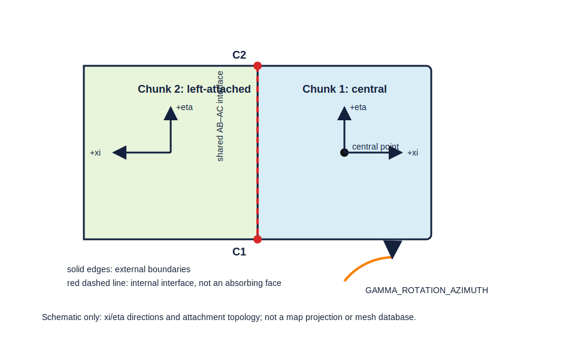

# Two-chunk regional simulations — ULVZ project guide

> **Operational authority.** This guide documents a project-local, accepted
> extension of the current SPECFEM3D_GLOBE source. It is not an upstream
> SPECFEM3D_GLOBE promise. When wording differs, use current source plus
> verified project geometry tests for operations; use the official manual for
> official behavior; retain Song/Kim material only as scientific provenance.

**Validated scope:** NCHUNKS=2; adjacent 90-degree cubed-sphere chunks; chunk
1 central; chunk 2 on the supported left side; complete-system placement by
central coordinates and GAMMA_ROTATION_AZIMUTH; accepted patch applied.
Canonical topology, Stacey roles, waveform symmetry/decomposition invariance,
and one-/six-chunk regressions passed at 2, 8, and 12 MPI ranks.
canonical_90deg_fixture_ready=true; general_two_chunk_mode_classification=B.

**Not established:** non-90-degree widths, unequal widths, other attachment
sides, nonadjacent chunks, independent orientations, arbitrary two-chunk
topology, or three-/general multi-chunk configurations.

<!-- guide-section:1 -->
## 1. Introduction

Regional simulation restricts computation to selected cubed-sphere chunks,
normally with absorbing outer boundaries. One chunk is the upstream-manual
regional path; six chunks form the global cubed sphere. This project’s
validated two-chunk mode is a specific two-face regional domain, appropriate
when a target geometry does not fit one 90-degree face but remains in two
adjacent faces. It is not an arbitrary shaped regional mesh.

The project patch corrects two AB--AC interface endpoints: C1 at eta-min was
historically omitted, while C2 at eta-max followed a spurious
three-member/rank-zero BC path. The accepted change creates reciprocal
two-member endpoint communication, protects unused members with INVALID_RANK,
and segments the xi-constant interface with NPROC_ETA. (Patch:
patches/specfem3d_globe/two_chunk_endpoints/; source:
src/meshfem3D/create_chunk_buffers.f90.)

The upstream Chapter 5 explains regional concepts but does not constitute
current official two-chunk support. (Official source:
specfem3d_globe/doc/USER_MANUAL/05_regional_simulations.tex.)

<!-- guide-section:2 -->
## 2. Geometry of the two chunks

Chunk 1 is the central AB face. Chunk 2 is the supported left-attached AC
face. Their common AB--AC face is internal; C1 and C2 are its physical eta-min
and eta-max endpoints. Each chunk has local xi and eta coordinates. In the
canonical geometry, the interface is xi-min on chunk 1 and xi-max on chunk 2;
it is segmented in eta, explaining the patch’s NPROC_ETA dependence.

All other lateral faces are external boundaries. An endpoint may share a node
with an external Stacey face without making the internal AB--AC face
absorbing: conditions have face roles, not node-only roles. The topology audit
found zero internal AB--AC Stacey faces at shallow, mid-mantle, and CMB-near
groups. (Project evidence: docs/two_chunk_corner_topology_acceptance.md.)

The 90-degree limit is operational. Current source stops when NCHUNKS>1 and
ANGULAR_WIDTH_XI_IN_DEGREES is not 90; it only forces eta=90 for more than two
chunks. That implementation permissiveness does **not** broaden this project’s
accepted range: both widths are 90 here. (Source:
src/shared/read_compute_parameters.f90.)

<!-- guide-section:3 -->
## 3. Coordinate system and rotation

CENTER_LATITUDE_IN_DEGREES and CENTER_LONGITUDE_IN_DEGREES locate chunk 1.
GAMMA_ROTATION_AZIMUTH rotates the complete two-chunk system about that
central placement; chunk 2 has no independent orientation. The official
regional manual describes gamma as an angle about the chunk center measured
counter-clockwise from due north. Current Euler code converts the center to
geocentric colatitude when ELLIPTICITY=.true. and builds the rotation matrix.
(Sources: 05_regional_simulations.tex; src/shared/euler_angles.f90.)

For a geographic point, the audit forms a Cartesian unit vector, applies the
transpose Euler matrix, then follows current chunk_map logic. Chunk 1 uses
xi=atan(y/z), eta=atan(-x/z), positive z; chunk 2 uses xi=atan(-z/y),
eta=atan(x/y), negative y. Valid local coordinates lie within the angular
half-width. (Source: src/auxiliaries/write_profile.f90,
get_latlon_chunk_location and chunk_map.)

1. Gamma zero retains the reference orientation at the supplied center.
2. Changing gamma moves both chunks together; it does not rotate chunk 2 alone.
3. Move a source--station geometry by changing center/gamma, then audit every
   point again before meshing.

Use cases/two_chunk_canonical_90deg/audit_geometry.py before meshing. It
reports membership and angular margins to the interface, C1/C2, and outer
faces. It is a pre-mesh canonical-case audit, not a substitute for mesher
location output.

<!-- guide-section:4 -->
## 4. Required patch

The project-local package is patches/specfem3d_globe/two_chunk_endpoints/.
Its JSON manifest is the only hash authority. For nested revision
9c312cb2c991b47484a7f302775f4f01ed9470f8, baseline target hash is
fd4137713e55e14ec664a9d55487b64c2b9bf73499c1f82780f1f5a6e63b088f; after
application create_chunk_buffers.f90 must hash to
8c64f1d1d415ec6c0792f06474dafcffcc698da6ee03ecd21bfd4fdc90b64857. Patch
file hash: 4496cea542d26f38575ec1fa9ae28635ec2a201958eb898702331c7db5fe4a60.

~~~bash
PATCH=patches/specfem3d_globe/two_chunk_endpoints/specfem3d_globe_two_chunk_endpoints.patch
patches/specfem3d_globe/two_chunk_endpoints/verify_patch.sh specfem3d_globe
git -C specfem3d_globe apply --check "$PATCH"
git -C specfem3d_globe apply "$PATCH"
sha256sum specfem3d_globe/src/meshfem3D/create_chunk_buffers.f90
git -C specfem3d_globe apply --reverse --check "$PATCH"
git -C specfem3d_globe apply --reverse "$PATCH"
~~~

Stop on a hash or context mismatch; rebuild clean objects after either source
transition. The patch is not cleanly applicable to clean v8.0.0 (6/10 hunks
failed), and no backport is supplied. (Authority: patch manifest; usage:
docs/two_chunk_project_patch.md.)

<!-- guide-section:5 -->
## 5. Par_file settings

Use exact current names from specfem3d_globe/DATA/Par_file. The teaching case
contains a full current-template copy at cases/two_chunk_canonical_90deg/DATA/Par_file.

| Parameter(s) | Role, constraint, and check |
| --- | --- |
| NCHUNKS | Set 2. Confirm audit total_mpi_ranks=8. |
| ANGULAR_WIDTH_XI_IN_DEGREES, ANGULAR_WIDTH_ETA_IN_DEGREES | Set both 90.d0. Do not infer support from the source’s looser eta check for exactly two chunks. |
| CENTER_LATITUDE_IN_DEGREES, CENTER_LONGITUDE_IN_DEGREES, GAMMA_ROTATION_AZIMUTH | Place/orient the whole system; re-audit after every change. |
| NEX_XI, NEX_ETA | Surface elements per central-chunk direction. Canonical validated value is 96; current template says multiples of 16 and 8 times relevant process count. |
| NPROC_XI, NPROC_ETA | Per-chunk decomposition; total=NCHUNKS*NPROC_XI*NPROC_ETA. Validated 1x1/chunk=2, 2x2/chunk=8, 2x3/chunk=12. Teaching case is 2x2/chunk. |
| MODEL, OCEANS, ELLIPTICITY, TOPOGRAPHY, GRAVITY, ROTATION, ATTENUATION | Select physics deliberately. Teaching fixture uses 1D_isotropic_prem and all listed switches false; this is not a scientific prescription. |
| RECORD_LENGTH_IN_MINUTES, NTSTEP_BETWEEN_OUTPUT_SEISMOS, NTSTEP_BETWEEN_OUTPUT_SAMPLE | Set duration/cadence. Select a physical window before earliest external return. |
| ABSORBING_CONDITIONS, ABSORB_USING_GLOBAL_SPONGE | Fixture uses Stacey absorption. Global sponge is NCHUNKS=6 only; it never applies to internal AB--AC. |
| REGIONAL_MESH_CUTOFF, REGIONAL_MESH_CUTOFF_DEPTH, REGIONAL_MESH_ADD_2ND_DOUBLING | Optional radial cutoff/doubling controls; retain current template’s allowed depth values. |
| LOCAL_PATH, LOCAL_TMP_PATH, SAVE_MESH_FILES, OUTPUT_SEISMOS_* | Database, mesh diagnostic, and waveform output controls; plan new run storage. |

NEX must match decomposition because source uses divisibility branches dependent
on mesh/doubling configuration. NEX=96 is compatible with 1x1, 2x2, and
2x3 per chunk. Do not lower it and claim equivalent waveform accuracy.
(Sources: DATA/Par_file; src/shared/read_compute_parameters.f90.)

<!-- guide-section:6 -->
## 6. Mesh resolution

NEX_XI/NEX_ETA control lateral spectral-element count; each element uses GLL
points. Radial layers and doubling/coarsening depend on model and regional
cutoff settings, so lateral NEX alone is not complete resolution information.
Increasing chunks/NEX increases mesh and database cost; ranks redistribute
work and add communication.

Choose target period, model complexity, source time function, and cadence;
then inspect Jacobians, actual timestep/CFL output, and target waveforms. The
manual’s regional-resolution discussion is an estimate, not a universal
accuracy formula. Canonical NEX=96 validates this patch fixture only.
(Sources: 05_regional_simulations.tex; docs/two_chunk_waveform_symmetry_closure.md.)

<!-- guide-section:7 -->
## 7. Source placement

CMTSOLUTION is a PDE header followed by event name, time shift, half duration,
latitude, longitude, depth, and Mrr Mtt Mpp Mrt Mrp Mtp. Current get_cmt.f90
reads these labels; example coordinates are geographic degrees and depth km.
(Sources: specfem3d_globe/DATA/CMTSOLUTION; src/specfem3D/get_cmt.f90.)

Define event; draw/audit boundaries; identify chunk; inspect interface, C1/C2,
and external margins; check depth versus model/radial layers; generate and
audit CMTSOLUTION. A source may be in either chunk. The interface is not a
physical boundary, but avoid exact interface/corner/element-face/edge placement
for sensitive work. Confirm requested versus located source in output.

<!-- guide-section:8 -->
## 8. Station placement

Each non-comment STATIONS record is station network latitude longitude
elevation burial; coordinates are degrees and elevation/burial metres. The
reader checks latitude and renames duplicate network/station pairs. (Sources:
specfem3d_globe/DATA/STATIONS; src/specfem3D/locate_receivers.f90.)

Audit every station for membership, duplicates, and outer margin. Stations may
span the internal interface, but avoid exact interface/endpoint/element
placement for sensitive comparisons. Plot source, stations, chunk outlines,
C1/C2, great-circle paths, classifications, and outer margins.

Do not prescribe a fixed angular safety distance. Estimate target arrivals and
the earliest external-boundary return, choose a window containing the target
phase and ending before that return, then enlarge margin or shorten the window
if necessary. More stations increase output/storage. Inspect the post-mesh
receiver list because current code can exclude out-of-region receivers.

<!-- guide-section:9 -->
## 9. Complete workflow

1. Verify/apply patch and candidate hash.
2. Prepare current-template Par_file with canonical two-chunk values.
3. Prepare/audit CMTSOLUTION and STATIONS.
4. Check total ranks and NEX compatibility.
5. Run xmeshfem3D; inspect mesh and Jacobians.
6. Create/read databases in the current executable workflow.
7. For patch validation, inspect C1/C2 reciprocity and zero internal AB--AC Stacey faces.
8. Run xspecfem3D; inspect finite outputs and physical arrivals.
9. Start patch reproduction with accepted 2-rank diagnostics, then use canonical 8/12-rank decompositions.
10. Compare fingerprints/traces without post-hoc time shifts.

~~~bash
bash cases/two_chunk_canonical_90deg/run_canonical.sh \
  --specfem-root specfem3d_globe \
  --run-dir results/two_chunk_canonical_run_<UTC> --dry-run
~~~

<!-- guide-section:10 -->
## 10. Validation checklist

- [ ] Patch manifest, source hash, and apply check agree.
- [ ] Both widths are 90; chunk 1 central, chunk 2 left-attached.
- [ ] Total ranks and NEX compatibility are correct.
- [ ] Source/stations are in-domain in pre-mesh audit.
- [ ] Travel-time assessment records window and return risk.
- [ ] Mesher reports intended mesh and acceptable Jacobians.
- [ ] C1/C2 are reciprocal two-member paths; internal AB--AC Stacey faces=0.
- [ ] Canonical 2/8/12 fingerprints agree when comparing fixture runs.
- [ ] Traces are finite, contain physical signal, and lack endpoint anomaly.
- [ ] Window contains arrivals; do not repeat invalid pre-arrival v2 [0,25] s.

Accepted v3 used [0,13] s with close receivers and a conservative outer-return
lower bound 272.9 s. This is fixture evidence, not a universal window.
(Evidence: docs/two_chunk_waveform_symmetry_closure.md.)

<!-- guide-section:11 -->
## 11. Troubleshooting

| Symptom | Cause | Check | Resolution |
| --- | --- | --- | --- |
| Mesher stops | Invalid parameter/geometry | Stop text; audit | Correct current-template values. |
| Wrong ranks | Per-chunk/total confusion | 2*NPROC_XI*NPROC_ETA | Launch that many ranks. |
| NEX stop | Incompatible decomposition | Source divisibility branch | Select compatible NEX/decomposition. |
| Point outside | Not in two faces | Audit/location output | Move point or whole system. |
| Corner/invalid rank | Missing patch/unsupported topology | Candidate hash; topology report | Stop and verify canonical context. |
| Internal Stacey claim | Node/face confusion | Face-role report | Require zero AB--AC face records. |
| Zero traces | Excluded receiver/source/input | Output lists/logs | Correct input in a new run. |
| Pre-arrival window | Convenience selection | Travel-time estimate | Redesign window; no trace shifting. |
| Rank mismatch | Different mesh/settings/defect | Fingerprint/raw traces | Reproduce canonical inputs; stop if unexplained. |
| Patch fails | Source changed | Manifest/verify script | Do not force; revalidate update. |

<!-- guide-section:12 -->
## 12. Worked example

cases/two_chunk_canonical_90deg/ contains a full teaching fixture:

- DATA/Par_file: NCHUNKS=2, both widths 90, center (90,90), gamma zero,
  NEX=96, 2x2/chunk, 13.6 s;
- DATA/CMTSOLUTION: 50 km deep isotropic teaching source in chunk 1;
- DATA/STATIONS: three chunk-1 and three chunk-2 receivers;
- audit_geometry.py: pre-mesh JSON/CSV/Markdown audit;
- generate_geometry_figure.py: this schematic;
- run_canonical.sh: deliberate 8-rank runner.

Write reports under results/, review --dry-run, then run only in a new directory.
Expected static result: seven in-domain points, source/C1 stations central,
C2 stations left-attached, total ranks 8, candidate hash match. This is not
Kim/Song Hawaiʻi input and does not itself establish production science readiness.

## Evidence and provenance

- Official: specfem3d_globe/doc/USER_MANUAL/05_regional_simulations.tex.
- Current source: DATA/Par_file, read_compute_parameters.f90, euler_angles.f90,
  get_cmt.f90, locate_receivers.f90, create_chunk_buffers.f90.
- Patch/hash authority: patches/specfem3d_globe/two_chunk_endpoints/specfem3d_globe_two_chunk_endpoints_manifest.json.
- Topology: docs/two_chunk_corner_topology_acceptance.md.
- Causal/waveform closure: docs/two_chunk_waveform_symmetry_closure.md and
  results/two_chunk_waveform_symmetry_closure_20260716T144230Z/07_reports/acceptance_matrix.json.
- Song/Kim production provenance remains incomplete; see
  results/two_chunk_corner_topology_acceptance_20260716T113245Z/11_hawaii_provenance/.
