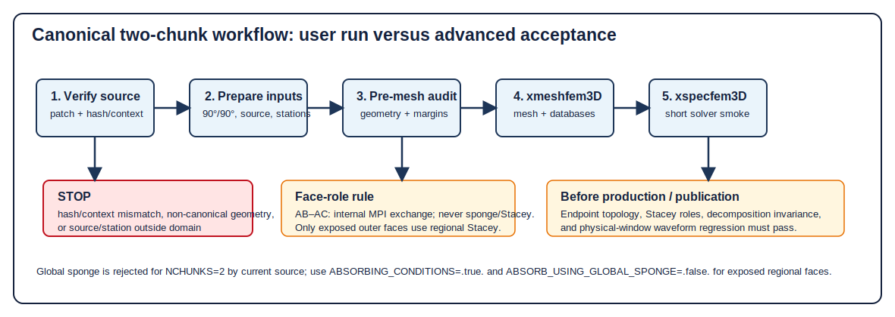

# Canonical two-chunk regional simulations — ULVZ project guide

> **Read this page first.** This project-local guide covers only the accepted
> canonical mode: NCHUNKS=2, two adjacent 90°×90° faces, AB central, AC joined
> on the supported local side, a single center/gamma orientation, and the
> accepted patch. It is not an upstream SPECFEM3D_GLOBE promise.
> canonical_90deg_fixture_ready=true;
> general_two_chunk_mode_classification=B.

> **Do not extrapolate.** Non-90° or unequal widths, other attachment sides,
> nonadjacent faces, independent orientations, arbitrary two-chunk topologies,
> and three-/general multi-chunk modes are unverified. The planner is read-only:
> it does not replace mesher, Stacey, or waveform acceptance. Kim/Song exact
> reconstruction still requires author inputs.

<!-- guide-section:1 -->
## 1. What this mode is, and the words used below

A regional simulation computes only selected cubed-sphere faces. One chunk is
the usual regional case; six chunks form the full sphere. This two-chunk mode
is useful only when the source, receivers, and target paths do not fit one 90°
face but do fit these two adjacent faces. It is not a free-form mesh.

| Term | Plain meaning and location | Why a user must care / visible failure |
| --- | --- | --- |
| **AB / AC** | The two faces used here. AB is central chunk 1; AC is attached chunk 2. | They identify the owner of a source or receiver. Swapping them changes supported topology. |
| **AB–AC interface** | The common interior face: AB xi-min meets AC xi-max. | It exchanges wavefield data; it is not an exterior wall and must never absorb. |
| **C1 / C2** | The two interface ends: C1 is eta-min; C2 is eta-max. Eta is face-local, not geographic south/north. | Endpoint errors cause missing or wrongly connected corner data and may vary by MPI layout. |
| **MPI rank / rank zero** | A rank is one MPI process; rank 0 is a valid process. | Rank 0 must not be treated as an unused slot. |
| **buffer / two-member path** | A buffer carries endpoint data between the two ranks meeting at C1 or C2. | Each endpoint needs exactly two reciprocal members in this mode. |
| **three-member / BC path** | Historical general-face corner logic included a BC participant not in this two-face domain. | It can create a false connection or conceal a missing endpoint. |
| **Stacey face / sponge** | Stacey absorbs on an exposed mesh face. A global sponge is a high-attenuation region in a six-chunk global model. | Neither may be put on AB–AC. |

**Implementation background.** Before the accepted patch, C1 had no eta-min
two-member record and C2 retained a BC/rank-zero three-member path. The patch
creates two endpoint records, uses INVALID_RANK only for unused slots, and
segments the xi-constant interface with NPROC_ETA.

<!-- guide-section:2 -->
## 2. Geometry: local attachment is not a map direction

The left panel is a **local topology drawing**, not a map. “Supported-left”
means that AC connects to AB's designated local edge: AB xi-min joins AC
xi-max. Once center latitude/longitude and gamma rotate the complete system,
AC may appear west, east, north, or south on a map. Say “attached to the
specified local edge”, not “geographically left”.

The dashed AB–AC line is internal. C1 is eta-min and C2 eta-max. Remaining
lateral faces are exposed. An endpoint can share a *node* with an external
Stacey face without making the internal face absorbing: face roles are
different. Accepted topology evidence found zero internal AB–AC Stacey faces
at shallow, mid-mantle, and CMB-near depths.

Current source stops when NCHUNKS > 1 and ANGULAR_WIDTH_XI_IN_DEGREES is not
90. It permits a non-90 eta width only for exactly two chunks, but this project
has not validated that case: set both widths to 90.

<!-- guide-section:3 -->
## 3. Center coordinates and GAMMA_ROTATION_AZIMUTH

CENTER_LATITUDE_IN_DEGREES and CENTER_LONGITUDE_IN_DEGREES place AB's center.
GAMMA_ROTATION_AZIMUTH rotates the **complete AB+AC system**; AC has no
independent orientation. The official regional manual says gamma is measured
counter-clockwise from due north. Current euler_angles.f90 and the project
planner use the same sign.

**Viewing convention:** look from outside the Earth toward the selected center,
with north up and east right in the tangent plane. Positive gamma is
counter-clockwise. With ELLIPTICITY=.false. and center=(0°,0°):

| Gamma | +eta | +xi | Meaning |
| ---: | --- | --- | --- |
| 0° | north | east | reference orientation |
| 90° | west | north | complete system rotated counter-clockwise |
| 180° | south | west | half turn |

With ellipticity enabled the source first converts geographic latitude to
geocentric colatitude; this does not change gamma's sign. Audit a source and
all stations after every center/gamma change. Never rotate AC separately.

### Determine AC's actual geographic position after setting parameters

There is no AC latitude, longitude, or gamma parameter. For canonical geometry,
the four inputs `NCHUNKS=2`, both 90° widths, AB center latitude/longitude,
and gamma determine every AB and AC boundary point uniquely: SPECFEM first
defines the fixed local AB--AC pair, then applies the same Euler transform to
the whole pair. AC is therefore not a second region that the user places.

For a selected center/lon/gamma, use `two_chunk_planner plan` with the same
minimum and maximum for each search range. Its `map.png` shows the transformed
AB/AC outline and interface; `geometry_audit.json` and `candidates.json` report
source/station chunk labels, local xi/eta, interface, C1/C2, and exposed-boundary
margins. This is the operational way to decide whether the intended geographic
region falls in AB, AC, the shared interface, or outside. It is a pre-mesh
geometric check, not a replacement for later mesh/Stacey/waveform validation.

At a geographic pole, longitude and gamma are not a unique parameterization.
The planner deliberately normalizes a polar center to longitude 0° and adjusts
gamma to preserve the same physical AB+AC orientation. Compare the plotted
outline, not only the three printed numbers, when reviewing a polar case.

<!-- guide-section:4 -->
## 4. Install the accepted patch safely

The package is patches/specfem3d_globe/two_chunk_endpoints/. Its JSON manifest
is the hash authority. It was validated against nested revision
9c312cb2c991b47484a7f302775f4f01ed9470f8. Baseline target SHA-256 is
fd4137713e55e14ec664a9d55487b64c2b9bf73499c1f82780f1f5a6e63b088f; applied
target SHA-256 must be
8c64f1d1d415ec6c0792f06474dafcffcc698da6ee03ecd21bfd4fdc90b64857.

### Minimum installation

Run from the project root. Stop on a hash or context mismatch.

~~~bash
PATCH="$(pwd)/patches/specfem3d_globe/two_chunk_endpoints/specfem3d_globe_two_chunk_endpoints.patch"
patches/specfem3d_globe/two_chunk_endpoints/verify_patch.sh specfem3d_globe
git -C specfem3d_globe apply --check $PATCH
git -C specfem3d_globe apply $PATCH
sha256sum specfem3d_globe/src/meshfem3D/create_chunk_buffers.f90
git -C specfem3d_globe apply --reverse --check $PATCH
~~~

The verifier must report baseline hash, single-file scope, no DEBUG change, and
a clean apply check. If the target already has the candidate hash, the reverse
dry-run identifies it as applied; do not apply twice. To reverse intentionally:
run git -C specfem3d_globe apply --reverse $PATCH, then rebuild from clean
objects.

### Strict traceability and manual replacement

Record nested revision, baseline hash, patch SHA-256
4496cea542d26f38575ec1fa9ae28635ec2a201958eb898702331c7db5fe4a60, forward
check, applied hash, and reverse check. Prefer git apply because it checks
context and leaves an auditable diff. Do **not** normally replace the complete
create_chunk_buffers.f90 file. If site policy requires it, preserve the
original, verify the exact baseline hash, compare the patch diff, verify the
candidate hash, and retain a tested restore path. Copying a file is not
two-chunk runtime acceptance. This patch does not cleanly apply to v8.0.0.

<!-- guide-section:5 -->
## 5. Inputs, external absorption, source, and stations

Start from current specfem3d_globe/DATA/Par_file. The teaching copy is
cases/two_chunk_canonical_90deg/DATA/Par_file.

| Setting | Canonical two-chunk instruction |
| --- | --- |
| NCHUNKS | Set 2. Total ranks = 2*NPROC_XI*NPROC_ETA. Accepted fixtures: 2, 8, 12 ranks. |
| ANGULAR_WIDTH_XI_IN_DEGREES, ANGULAR_WIDTH_ETA_IN_DEGREES | Set both 90.d0. |
| CENTER_LATITUDE_IN_DEGREES, CENTER_LONGITUDE_IN_DEGREES, GAMMA_ROTATION_AZIMUTH | Place/rotate whole domain; use a fixed-geometry planner check after every change. |
| NEX_XI, NEX_ETA, NPROC_XI, NPROC_ETA | NEX=96 and 2×2/chunk are the accepted teaching fixture, not generic cheap production accuracy. Keep source divisibility constraints. |
| MODEL, OCEANS, ELLIPTICITY, TOPOGRAPHY, GRAVITY, ROTATION, ATTENUATION | Choose physical assumptions deliberately. Teaching switches are not a scientific prescription. |
| RECORD_LENGTH_IN_MINUTES, NTSTEP_BETWEEN_OUTPUT_SEISMOS, NTSTEP_BETWEEN_OUTPUT_SAMPLE | Select duration/cadence from a target signal and documented external-return assessment. |
| ABSORBING_CONDITIONS | Set .true. for canonical two chunks. Mesher builds Stacey arrays only for exposed faces. |
| ABSORB_USING_GLOBAL_SPONGE, SPONGE_LATITUDE_IN_DEGREES, SPONGE_LONGITUDE_IN_DEGREES, SPONGE_RADIUS_IN_DEGREES | Set sponge flag .false. Current source stops if it is true with NCHUNKS=2. |
| REGIONAL_MESH_CUTOFF, REGIONAL_MESH_CUTOFF_DEPTH, REGIONAL_MESH_ADD_2ND_DOUBLING | Optional radial controls; retain allowed current-template values and recheck mesh/Jacobians. |
| LOCAL_PATH, LOCAL_TMP_PATH, SAVE_MESH_FILES, OUTPUT_SEISMOS_* | Plan new-run database, diagnostic, and waveform storage. |

### What actually absorbs in two chunks

Global sponge is a six-chunk global-model option. read_parameter_file.F90 reads
SPONGE_* only when its flag is true, while read_compute_parameters.f90 stops
any non-six-chunk request with “Please set NCHUNKS to 6 in Par_file to use
ABSORB_USING_GLOBAL_SPONGE”. Its Qmu modification is reached through the
ATTENUATION model path; it is not a local side-face condition.

For NCHUNKS=2, create_regions_mesh.F90 invokes Stacey setup when
ABSORBING_CONDITIONS=.true. get_absorb.f90 includes AC xi-min, AB xi-max, and
exposed eta faces; it excludes AB xi-min and AC xi-max, the shared interface.
A radial bottom face is added only where the source logic calls for it (outer
core or regional cut-off). Therefore **AB–AC is never sponge, Stacey, or any
absorbing face**. If a result says otherwise, stop for a face-role audit.
The exact parameter guards and call path are documented in
[the absorbing-boundary source audit](two_chunk_absorbing_boundary_audit.md).

CMTSOLUTION contains PDE, event name, time shift, half duration, latitude,
longitude, depth, and Mrr Mtt Mpp Mrt Mrp Mtp. STATIONS records are station
network latitude longitude elevation burial. Sources/stations may be in either
face, but avoid exact interface, endpoint, element face/edge, or exterior-face
placement. Do not prescribe a fixed angular safety distance: estimate target
arrival and earliest external return.

<!-- guide-section:6 -->
## 6. Custom simulation workflow and teaching fixture

Do not mix these two workflows. The first is for **your own prepared input**;
the second only checks or runs the project's fixed teaching case. Neither is
formal patch acceptance. Every writing command uses a new output directory.

### A. Plan and run your own canonical configuration

1. Check source and patch (section 4). Prepare your own `DATA/Par_file`,
   `CMTSOLUTION`, and `STATIONS`; set two 90° widths,
   `ABSORBING_CONDITIONS=.true.`, and `ABSORB_USING_GLOBAL_SPONGE=.false.`.
2. If geometry is not yet chosen, use the package planner guide for a bounded
   center/lon/gamma search. Once a candidate is chosen, use the fixed-range
   command below to display and classify that exact geometry. Replace all
   values marked for replacement; the output directory must not exist.

~~~bash
export ULVZ_PYTHON=/import/freenas-m-01-seismology/xjiang/software/anaconda3/envs/ulvz-specfem/bin/python
SPECFEM_ROOT="$(pwd)/specfem3d_globe"
INPUT_DATA="/absolute/path/to/YOUR_CASE/DATA"
CENTER_LAT=20.0
CENTER_LON=160.0
GAMMA=30.0
ANALYSIS_END_S=1900
PLAN_DIR="results/two_chunk_geometry_$(date -u +%Y%m%dT%H%M%SZ)"
PYTHONPATH=packages/two_chunk_planner/src $ULVZ_PYTHON -m two_chunk_planner plan \
  --cmtsolution "$INPUT_DATA/CMTSOLUTION" --stations "$INPUT_DATA/STATIONS" \
  --par-file "$INPUT_DATA/Par_file" --target-energy-end-s "$ANALYSIS_END_S" \
  --latitude-range "$CENTER_LAT,$CENTER_LAT" --longitude-range "$CENTER_LON,$CENTER_LON" \
  --gamma-range "$GAMMA,$GAMMA" --output "$PLAN_DIR"
~~~

3. Open `PLAN_DIR/map.png` to see the actual geographic AB/AC boundaries. Read
   the chosen candidate's point classifications before continuing. If no
   feasible candidate is returned, or a required point is outside/on an
   endpoint/external boundary, stop and change geometry. Review—not blindly
   copy—`recommended_Par_file.inc`, then transfer its center/lon/gamma and any
   deliberately selected mesh settings into your own `Par_file`.
4. Run your own input only after the preceding review. `NPROCS=8` is the
   validated 2×2-per-chunk example; change it only to a compatible layout.

~~~bash
NPROCS=8
SPECFEM_ROOT="$(pwd)/specfem3d_globe"
INPUT_DATA="/absolute/path/to/YOUR_CASE/DATA"
RUN_DIR="results/my_two_chunk_run_$(date -u +%Y%m%dT%H%M%SZ)"
test ! -e "$RUN_DIR" || { echo "refusing to overwrite $RUN_DIR" >&2; exit 2; }
mkdir -p "$RUN_DIR/DATA" "$RUN_DIR/DATABASES_MPI" "$RUN_DIR/OUTPUT_FILES"
cp -R "$INPUT_DATA/." "$RUN_DIR/DATA/"
(cd "$RUN_DIR" && mpirun -np "$NPROCS" "$SPECFEM_ROOT/bin/xmeshfem3D")
(cd "$RUN_DIR" && mpirun -np "$NPROCS" "$SPECFEM_ROOT/bin/xspecfem3D")
~~~

`xmeshfem3D` produces the mesh and `DATABASES_MPI`; `xspecfem3D` reads those
databases. This source tree has no separate `xgenerate_databases` command.

### B. Check or run the fixed teaching fixture

`audit_geometry.py` is intentionally restricted to
`cases/two_chunk_canonical_90deg/DATA` (center 90°, longitude 90°, gamma 0°).
`run_canonical.sh` copies that same teaching `DATA/`; it is not a reviewer and
must not be used to launch your own inputs. Its dry-run is only a command
preview for the teaching fixture.

~~~bash
SPECFEM_ROOT="$(pwd)/specfem3d_globe"
$ULVZ_PYTHON cases/two_chunk_canonical_90deg/audit_geometry.py --validate-only --specfem-root "$SPECFEM_ROOT"
bash cases/two_chunk_canonical_90deg/run_canonical.sh --specfem-root "$SPECFEM_ROOT" \
  --run-dir "results/two_chunk_canonical_run_$(date -u +%Y%m%dT%H%M%SZ)" --dry-run
~~~

Expected: the teaching audit reports status pass and total MPI ranks 8; its
dry-run prints the 8-rank `xmeshfem3D` then `xspecfem3D` commands without
creating the run directory. Remove `--dry-run` only to reproduce that teaching
fixture, not to run a custom study.

<!-- guide-section:7 -->
## 7. Full production or release acceptance

Keep these checks separate from first use.

The diagram's pre-mesh step is the custom-input planner workflow in section 6A.
The teaching audit and teaching runner in section 6B are separate fixture tools.

| Level | Required evidence | Stop condition |
| --- | --- | --- |
| Must | Patch context; canonical widths; in-domain points; finite mesher/solver output | mismatch, non-90° geometry, outside point, or mesher failure |
| Changed patch/source | C1/C2 reciprocal two-member paths; no INVALID_RANK member; zero internal AB–AC Stacey faces | missing endpoint, BC/three-member path, or internal absorbing face |
| Decomposition claim | Equivalent 2/8/12 physical fingerprints, connectivity, materials, buffers, face roles | unexplained rank difference |
| Waveform claim | Valid fixed physical window; no shift; no NaN/Inf; NRMS and relative energy <=1e-5 | endpoint anomaly, invalid window, arrival shift, threshold failure |
| Recommended science | Target-arrival and external-return assessment; margins/path coverage | boundary contamination risk |
| Developer evidence | One-/six-chunk regression and controlled reversed reproduction | no broad causal claim without them |

Accepted v3 achieved maximum NRMS 2.92e-6 and relative energy difference
2.86e-6 at 2/8/12 ranks. The earlier v2 [0,25] s window was before an
approximately 52 s first arrival; it was invalid, not a reason to loosen gates.

<!-- guide-section:8 -->
## 8. Resolution and MPI choices

NEX_XI/NEX_ETA are lateral spectral-element counts; GLL points lie inside
elements. Radial layers/doubling, model complexity, source bandwidth, timestep,
and output cadence also matter. NEX=96 is an accepted canonical geometry
fixture, not automatically a low-cost smoke mesh or production prescription.

Per chunk, decomposition is NPROC_XI × NPROC_ETA; total ranks are
2*NPROC_XI*NPROC_ETA. Accepted fixtures are 1×1/chunk=2, 2×2/chunk=8, and
2×3/chunk=12. Other compatible layouts are not project-validated. If mesher
stops, choose compatible NEX/ranks; never bypass the source checks.

<!-- guide-section:9 -->
## 9. What each audit actually checks

| Tool or record | Input | Output / pass meaning | It does not prove |
| --- | --- | --- | --- |
| verify_patch.sh | worktree and patch | source SHA, one-file scope, no DEBUG, clean apply context | topology or waveform |
| audit_geometry.py | fixed teaching `DATA/` only | static teaching-fixture input/hash/membership check | arbitrary user center/gamma, databases, Jacobians, Stacey, waveforms |
| two_chunk_planner plan | user source/stations, candidate geometry, optional path/window | deterministic center/gamma candidates; actual AB/AC map and point classification | mesher, solver, or production-safe return time |
| stacey.bin analysis | generated databases | face roles; internal AB–AC count must be zero | science window |
| acceptance reports | controlled diagnostic runs | ownership, reciprocity, fingerprints, fixed-window metrics | general two-chunk support |

There is no single “run audit tool”. Use the chain: source integrity → geometry
→ mesh/database face roles → solver/waveforms.

<!-- guide-section:10 -->
## 10. One-page checklist

- [ ] Patch hash/context and git apply --check agree.
- [ ] NCHUNKS=2; both widths 90; AB central and AC on specified local edge.
- [ ] ABSORBING_CONDITIONS=.true.; ABSORB_USING_GLOBAL_SPONGE=.false.
- [ ] Total ranks = 2*NPROC_XI*NPROC_ETA; NEX compatible.
- [ ] Source/stations are in-domain and not exactly on interface/C1/C2/faces.
- [ ] Window contains target arrival and documented return risk; it is not a universal window.
- [ ] Mesher completes with intended dimensions and acceptable Jacobians.
- [ ] New DATABASES_MPI/stacey.bin exist; required face-role audit finds zero internal AB–AC Stacey faces.
- [ ] Solver traces are finite and physical.
- [ ] Any symmetry claim has fingerprints and unshifted fixed-window metrics.

<!-- guide-section:11 -->
## 11. Troubleshooting

| Symptom | Likely cause | Check | Safe response |
| --- | --- | --- | --- |
| “Please set NCHUNKS to 6 ... GLOBAL_SPONGE” | sponge enabled in two chunks | ABSORB_USING_GLOBAL_SPONGE | set .false.; use external Stacey |
| Claimed Stacey interface | node/face confusion or defect | face-role record | require zero AB–AC **face** records; stop if nonzero |
| Patch verifier fails | unmatched or already-applied source | baseline/candidate SHA, reverse check | do not force/overwrite; revalidate version |
| Mesher rejects ranks/NEX | incompatible decomposition | Par_file and stop text | choose compatible layout |
| Point outside | center/gamma or coordinates wrong | planner for custom input; teaching audit for fixture | move point or complete system, then rerun the applicable check |
| Zero/invalid trace | excluded receiver/input/solver failure | receiver list/log | correct inputs in a new run |
| Poor pre-arrival comparison | invalid window | travel-time assessment | redesign window; never shift traces |
| Rank disagreement | settings/mesh defect | fingerprint/raw traces | reproduce canonical inputs and stop if unexplained |

<!-- guide-section:12 -->
## 12. Teaching case, glossary, and evidence

cases/two_chunk_canonical_90deg/ is a teaching fixture, not Kim/Song Hawaiʻi
input or a production model. It contains NEX=96, 2×2/chunk, an isotropic 50 km
source, stations in both faces, audit_geometry.py, figure source, and the
deliberate runner. Static audit should report seven in-domain points and eight
total ranks. Its audit and runner do not audit or launch a custom input case.

**Glossary.** An external boundary is exposed and may be Stacey. The internal
interface exchanges wavefield and can never be sponge/Stacey. C1/C2 are
interface endpoints; shared nodes do not merge face roles. A fingerprint is a
physical mesh summary, not a count of MPI files.

**Evidence.** Official regional behavior is in
specfem3d_globe/doc/USER_MANUAL/05_regional_simulations.tex. Current geometry
is in euler_angles.f90, write_profile.f90, and read_compute_parameters.f90.
Absorption is in read_parameter_file.F90, create_regions_mesh.F90,
get_absorb.f90, get_model.F90, and meshfem3D_models.F90. Patch hashes are in
patches/specfem3d_globe/two_chunk_endpoints/. Accepted topology and waveform
closure are in docs/two_chunk_corner_topology_acceptance.md and
docs/two_chunk_waveform_symmetry_closure.md. The documentation-change record is
[the revision report](two_chunk_regional_simulations_guide_revision_report.md).
